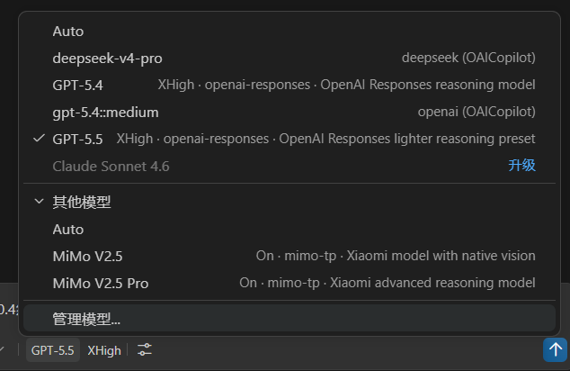

# MiMo for Copilot Chat

> A VS Code extension that adds MiMo, DeepSeek, and OpenAI Responses-compatible models to Copilot Chat without replacing Copilot’s native experience.

<p align="center">
  <a href="https://github.com/ClockZinc/mimo-for-copilot">
    
  </a>
</p>

<p align="center">
  
</p>

## ✨ Overview

MiMo for Copilot Chat plugs additional provider-backed models directly into the Copilot Chat model picker.
It keeps the built-in Copilot workflow intact while adding support for:

- 🧠 Xiaomi MiMo models
- 🔷 DeepSeek V4 models
- 🌐 OpenAI Responses-compatible providers
- 🔑 provider-specific API keys and Base URLs
- 👁️ model visibility controls
- 🧩 memory-mode configuration

## 🗺️ Visual at a glance


## 🎯 What you get

- 🚀 Use new models inside the native Copilot Chat UI
- 🛠️ Keep agent mode, tool calling, instructions, workspace search, and editor actions
- 🔒 Store keys securely in VS Code `SecretStorage`
- 🔁 Switch between providers without changing your workflow
- 🧰 Configure built-in and custom models from one place

## 🧪 Supported providers

- `mimo` → `https://api.xiaomimimo.com/v1`
- `mimo-tp` → `https://token-plan-cn.xiaomimimo.com/v1`
- `deepseek` → `https://api.deepseek.com`
- `openai-responses` → any compatible `/responses` endpoint

## 🧬 Supported models

- MiMo V2.5 Pro
- MiMo V2.5
- MiMo V2 Pro
- MiMo V2 Flash
- DeepSeek V4 Pro
- DeepSeek V4 Flash
- GPT-5.4
- GPT-5.5

## 📦 Install

### 🛒 Marketplace

Install the extension from the VS Code Marketplace.

### 📎 VSIX

1. Download or build the VSIX.
2. Run **Extensions: Install from VSIX...** in VS Code.
3. Select the `.vsix` file and reload the window.

## ⚡ Quick start

1. Open the Command Palette.
2. Run **MiMo: Open Provider Configuration** or **MiMo: Set API Key**.
3. Add one or more providers.
4. Open Copilot Chat and pick a model.
5. Optionally show or hide built-in models in the configuration page.

## 🧰 Configuration

Key settings include:

- `mimo-copilot.providers`
- `mimo-copilot.models`
- `mimo-copilot.hiddenModels`
- `mimo-copilot.maxTokens`
- `mimo-copilot.agenticMemory`
- `mimo-copilot.memory.recallModel`
- `mimo-copilot.modelIdOverrides`

## 📝 Notes

- Copilot Chat features remain available.
- DeepSeek and MiMo routing depend on the configured provider and API key.
- API keys are not written to `settings.json`.

## 🛠️ Development

```bash
npm install
npm run compile
npx vsce package
```

## 🙏 Fork & Credits

This project is forked from and based on [Vizards/deepseek-v4-for-copilot](https://github.com/Vizards/deepseek-v4-for-copilot).

Thanks to the original author and contributors for the DeepSeek Copilot Chat provider foundation. This fork keeps the upstream MIT license notice and extends the project with MiMo provider support, multi-provider configuration, memory features, and Responses-compatible model support.

## License

MIT
