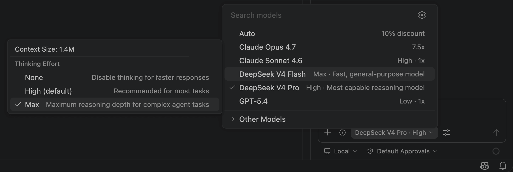

<h1 align="center">MiMo for Copilot Chat</h1>

> **Forked from [Vizards/deepseek-v4-for-copilot](https://github.com/Vizards/deepseek-v4-for-copilot)** — original extension by [Vizards](https://github.com/Vizards). This fork adds Xiaomi MiMo model support, Token Plan routing, multi-provider configuration, model visibility management, and memory-mode configuration.

<p align="center">
  <a href="https://github.com/ClockZinc/mimo-for-copilot"></a>
</p>

**Use Xiaomi MiMo and DeepSeek models from the Copilot Chat model picker — and keep everything Copilot already gives you.**

<p align="center">
  
</p>

Want MiMo, DeepSeek, Copilot agent mode, tool calling, memory workflows, and a proper provider UI in one place? This extension plugs **MiMo V2.5 Pro / V2.5 / V2 Pro / V2 Flash** and **DeepSeek V4 Pro / Flash** directly into Copilot Chat — with **multi-provider BYOK**, **Token Plan support**, **thinking mode**, **tool calling**, and **memory model controls**.

## Why this extension?

- **Don't replace Copilot — power it up.** No new sidebar, no new chat UI to learn. Just more models in the picker you already use.
- **Copilot capabilities stay intact.** Agent mode, tool calling, instructions, MCP, workspace search, terminal, and editor actions still work.
- **MiMo + DeepSeek in one extension.** Use official MiMo endpoints, MiMo Token Plan, and DeepSeek side by side.
- **BYOK with per-provider secrets.** Separate API keys and Base URLs are stored securely in VS Code `SecretStorage`.

## Features

### MiMo + DeepSeek model picker integration
Built-in models can appear directly in Copilot Chat's native model picker:

- **MiMo V2.5 Pro** — reasoning / coding / tools
- **MiMo V2.5** — multimodal understanding + tools
- **MiMo V2 Pro** — lightweight reasoning / memory-friendly model
- **MiMo V2 Flash** — fast, lower-latency MiMo model
- **DeepSeek V4 Pro / Flash** — DeepSeek routing when configured

Switch models mid-chat without losing history.

Notes:

- `MiMo V2 Pro` and `MiMo V2 Flash` are **hidden by default** and can be shown from the Provider Configuration page.
- DeepSeek built-in models are automatically hidden from the picker when no DeepSeek API key is configured.
- `MiMo V2 Flash` is routed to the direct MiMo endpoint, not MiMo Token Plan.

### Multi-provider configuration UI
Use **MiMo: Open Provider Configuration** to manage:

- multiple providers
- separate API keys
- separate Base URLs
- built-in and custom models
- built-in model hide/show
- memory mode and recall model selection

This makes it easy to mix:

- `mimo` → `https://api.xiaomimimo.com/v1`
- `mimo-tp` → `https://token-plan-cn.xiaomimimo.com/v1`
- `deepseek` → `https://api.deepseek.com`

### Vision support

- **MiMo V2.5** supports native multimodal understanding.
- **DeepSeek V4** remains text-only, so this extension can proxy image understanding through another installed Copilot model and forward the description.

<p align="center">
  
</p>

### Thinking mode support

- **DeepSeek models** use `none / high / max` reasoning effort.
- **MiMo models** use `on / off` reasoning control where supported.

Reasoning controls are exposed through Copilot Chat's model picker configuration UI.

### MiMo Token Plan support
Supported MiMo models can be automatically routed to **MiMo Token Plan** when a `mimo-tp` key is configured.

Current routing behaviour in this fork:

- `mimo-v2.5-pro` → supports `mimo` / `mimo-tp`
- `mimo-v2.5` → supports `mimo` / `mimo-tp`
- `mimo-v2-pro` → supports `mimo` / `mimo-tp`
- `mimo-v2-flash` → direct `mimo` only

### Memory mode configuration
This fork also adds a **memory mode** section in the Provider Configuration UI:

- enable / disable Agentic Memory
- choose a recall model
- use `MiMo V2 Pro` as the default memory model

### Inherits Every Copilot Capability
Because this plugs into Copilot's native provider API, you get the full stack for free:
- **Agent mode** — autonomous multi-step tasks
- **Tool calling** — file edits, terminal, workspace search, Git, tests
- **Instructions & skills** — all your `.instructions.md`, `AGENTS.md`, and skills just work
- **Prompt / usage stats** — useful request and provider routing logs in the output channel

<p align="center">
  
</p>

### Secure by Default
API keys live in VS Code's `SecretStorage` (OS keychain on macOS / Windows / Linux). Never in `settings.json`, never in Git history.

### Zero Runtime Dependencies
Pure VS Code API + Node.js built-ins. No Python, no Docker, no local proxy server to babysit.

## Getting Started

### Prerequisites

- VS Code 1.116 or later. This extension relies on non-public Copilot Chat APIs that may break on newer VS Code versions — [report an issue](https://github.com/Vizards/deepseek-v4-for-copilot/issues) if you hit one.
- GitHub Copilot subscription (Free / Pro / Enterprise — the free tier works)
- MiMo API key and/or MiMo Token Plan key from [platform.xiaomimimo.com](https://platform.xiaomimimo.com)
- Optional DeepSeek API key from [platform.deepseek.com](https://platform.deepseek.com)

### Usage

1. Install from the VS Code Marketplace or install the VSIX manually.
2. Run **MiMo: Open Provider Configuration** or **MiMo: Set API Key** from the Command Palette.
3. Configure one or more providers:
  - `mimo`
  - `mimo-tp`
  - `deepseek`
4. Open Copilot Chat and pick an available MiMo or DeepSeek model.
5. Optionally show hidden built-in models from the Provider Configuration page.

## Models

| Model | Best For | Default Visibility | Provider Notes |
|---|---|---|---|
| **MiMo V2.5 Pro** | Complex coding, reasoning, tools | visible | `mimo` / `mimo-tp` |
| **MiMo V2.5** | Multimodal understanding, tools | visible | `mimo` / `mimo-tp` |
| **MiMo V2 Pro** | Memory / lightweight reasoning | hidden | `mimo` / `mimo-tp` |
| **MiMo V2 Flash** | Fast MiMo responses | hidden | `mimo` only |
| **DeepSeek V4 Flash** | Fast everyday coding | visible when DeepSeek key exists | `deepseek` |
| **DeepSeek V4 Pro** | Deep reasoning, larger refactors | visible when DeepSeek key exists | `deepseek` |

## Settings

| Setting | Default | Description |
|---|---|---|
| `mimo-copilot.providers` | built-in provider list | Provider definitions with separate Base URLs |
| `mimo-copilot.models` | `[]` | User model overrides and custom models |
| `mimo-copilot.hiddenModels` | `mimo-v2-pro`, `mimo-v2-flash` | Hidden built-in model IDs |
| `mimo-copilot.maxTokens` | `0` | Max output tokens (`0` = API default) |
| `mimo-copilot.modelIdOverrides` | official IDs | Override actual API model IDs |
| `mimo-copilot.agenticMemory` | `false` | Enable memory mode |
| `mimo-copilot.memory.recallModel` | `mimo-v2-pro` | Recall / memory model |
| `mimo-copilot.visionModel` | *(auto)* | Vision proxy model |
| `mimo-copilot.visionPrompt` | built-in | Prompt used for image description proxying |

Reasoning settings are configured from Copilot Chat's model picker per model.

Example `settings.json` override for compatible API proxies:

```json
{
  "mimo-copilot.modelIdOverrides": {
    "mimo-v2.5-pro": "your-mimo-pro-id",
    "mimo-v2.5": "your-mimo-vision-id",
    "mimo-v2-pro": "your-mimo-v2-pro-id",
    "mimo-v2-flash": "your-mimo-flash-id",
    "deepseek-v4-flash": "your-deepseek-flash-id",
    "deepseek-v4-pro": "your-deepseek-pro-id"
  }
}
```

## Compared to alternatives

| | This extension | Local proxy (e.g. LiteLLM) | Standalone DeepSeek extensions |
|---|---|---|---|
| Works inside Copilot Chat | ✅ | ✅ | ❌ separate UI |
| Agent mode, tools, skills | ✅ | ✅ | ⚠️ reimplemented |
| Vision support | ✅ proxied | ❌ | ❌ |
| Extra process to run | ❌ | ✅ | ❌ |
| One-click install | ✅ | ❌ | ✅ |
| API key in OS keychain | ✅ | ❌ | ⚠️ varies |

## License

[MIT](LICENSE)
