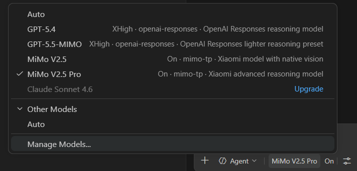
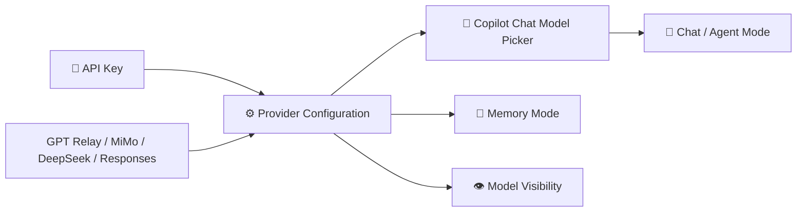
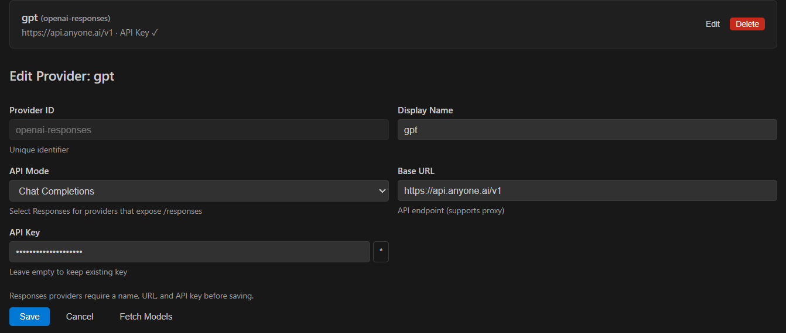
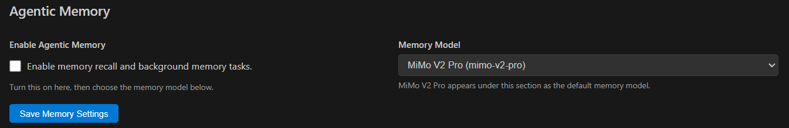
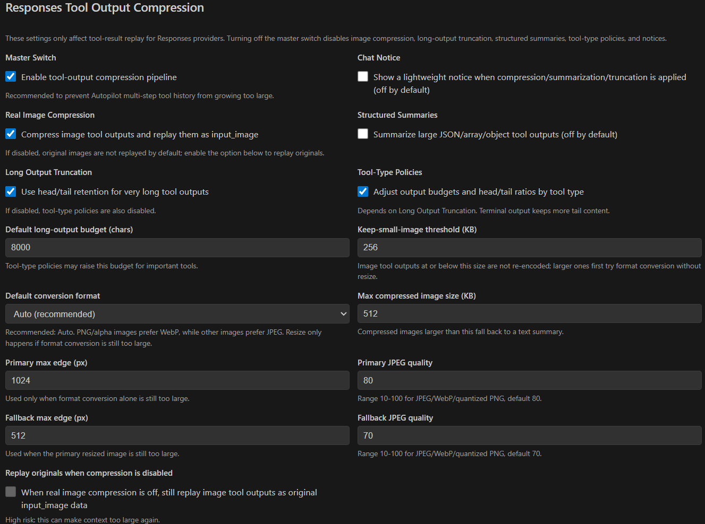

<h1 align="center">MiMo for Copilot Chat</h1>

<p align="center">
  Use <strong>GPT relay/proxy providers</strong>, <strong>MiMo</strong>, <strong>DeepSeek</strong>, and <strong>OpenAI-compatible</strong> models in the native GitHub Copilot Chat experience.
</p>

<p align="center">
  <a href="https://marketplace.visualstudio.com/items?itemName=clockzincbit.mimo-for-copilot"><strong>Install from Marketplace</strong></a>
  ·
  <a href="#-quick-start"><strong>Quick Start</strong></a>
  ·
  <a href="#%EF%B8%8F-configuration-page"><strong>Configuration</strong></a>
</p>

<p align="center">
  
</p>

<table>
  <tr>
    <td><strong>Native Copilot Chat</strong><br>Use additional models directly from the Copilot Chat model picker.</td>
    <td><strong>Multi-provider BYOK</strong><br>Configure GPT relay/proxy providers, MiMo, DeepSeek, Chat Completions, and Responses-compatible endpoints with secure keys.</td>
    <td><strong>Token & compression visibility</strong><br>See actual API prompt tokens and MiMo compression ratios from the status bar.</td>
  </tr>
  <tr>
    <td><strong>Agent tools</strong><br>Keep agent mode, tool calling, workspace context, and editor actions.</td>
    <td><strong>Agentic Memory</strong><br>Configure memory recall and model routing from the built-in panel.</td>
    <td><strong>Responses compression</strong><br>Compress tool images and long outputs before they hit model limits.</td>
  </tr>
</table>

## ⚡ Quick start

### 1) Open setup from the Command Palette

- Press **`Ctrl+Shift+P`** on Windows/Linux or **`Cmd+Shift+P`** on macOS.
- Type one of these commands:
  - **`MiMo: Set API Key`**
  - **`MiMo: Open Provider Configuration`**

This is the fastest way to configure the extension after installation.

### 2) Pick a model in Copilot Chat

After configuring a provider, open **Copilot Chat** and use the model picker.

- You can choose MiMo / DeepSeek / Responses-compatible models directly in the picker.
- You can also use **`Manage Models...`** from the picker when needed.

<p align="center">
  
</p>

### 3) Find the configuration page from the token indicator

After the extension is active, look at the **bottom-right status bar** in VS Code.

- A **MiMo token usage indicator** appears there.
- Click it to open the **Provider & Model Configuration** page.
- Its tooltip shows the real API prompt-token value after MiMo preprocessing. When MiMo compresses tool output, it also shows the estimated pre-compression value and compression ratio.

This is the easiest always-visible entry point once the extension is running.

## ✨ Overview

MiMo for Copilot Chat plugs GPT relay/proxy providers and additional provider-backed models directly into the Copilot Chat model picker.
It keeps the built-in Copilot workflow intact while adding support for:

- 🌉 GPT relay/proxy providers
- 🧠 Xiaomi MiMo models
- 🔷 DeepSeek V4 models
- 🌐 Chat Completions and OpenAI Responses-compatible providers
- 🔑 provider-specific API keys and Base URLs
- 👁️ model visibility controls
- 🧩 memory-mode configuration

## 🗺️ Visual at a glance



## 🎯 What you get

- 🚀 Use new models inside the native Copilot Chat UI
- 🛠️ Keep agent mode, tool calling, instructions, workspace search, and editor actions
- 🔒 Store keys securely in VS Code `SecretStorage`
- 🔁 Switch between providers without changing your workflow
- 🧰 Configure built-in and custom models from one place

## ⚙️ Configuration page

The configuration page includes:

- API provider management
- model management
- Agentic Memory settings
- Responses tool-output compression settings

The configuration UI is adapted from the OAI-compatible Copilot-style settings experience and customized for MiMo providers, model routing, memory, and Responses compression controls.

### Provider API mode

When editing a provider, choose the API mode that matches the endpoint and then click **Save**:

- **Chat Completions** for OpenAI-compatible `/chat/completions` providers, for example a base URL like `https://api.anyone.ai/v1`.
- **Responses** for providers that expose the OpenAI `/responses` API.

If a provider was created with the wrong mode, open **Provider Configuration**, click **Edit**, change **API Mode** to **Chat Completions** or **Responses**, and save it again.

<p align="center">
  
</p>

### Agentic Memory

Use this section to enable memory recall and choose the memory model.

<p align="center">
  
</p>

### Responses tool-output compression

Use this section to control:

- real image compression
- format conversion before resize
- long-output truncation
- tool-type policies
- structured summaries
- replay behavior for original images

If a tool image remains too large and has to be removed, MiMo always emits a bold chat warning even when optional chat notices are disabled.

<p align="center">
  
</p>

## 🧪 Supported providers

- `mimo` → `https://api.xiaomimimo.com/v1`
- `mimo-tp` → `https://token-plan-cn.xiaomimimo.com/v1`
- `deepseek` → `https://api.deepseek.com`
- `openai-responses` → any compatible `/responses` endpoint

## 🧬 Supported models

- MiMo V2.5 Pro
- MiMo V2.5
- MiMo V2 Pro
- MiMo V2 Flash
- DeepSeek V4 Pro
- DeepSeek V4 Flash
- GPT-5.4
- GPT-5.5 — defaults to 258K input / 128K output tokens and can be overridden in model settings

## 📦 Install

### 🛒 Marketplace

Install the extension from the VS Code Marketplace.

### 📎 VSIX

1. Download or build the VSIX.
2. Run **Extensions: Install from VSIX...** in VS Code.
3. Select the `.vsix` file and reload the window.

## 🧭 Typical workflow

1. Open the Command Palette with **`Ctrl+Shift+P`** / **`Cmd+Shift+P`**.
2. Run **`MiMo: Set API Key`** or **`MiMo: Open Provider Configuration`**.
3. Add one or more providers.
4. Open Copilot Chat and pick a MiMo / DeepSeek / Responses model.
5. Use the **bottom-right token usage indicator** whenever you want to reopen the configuration page.
6. Optionally configure memory mode and Responses tool-output compression.

## 🧰 Configuration

Key settings include:

- `mimo-copilot.providers`
- `mimo-copilot.models`
- `mimo-copilot.hiddenModels`
- `mimo-copilot.maxTokens`
- `mimo-copilot.agenticMemory`
- `mimo-copilot.memory.recallModel`
- `mimo-copilot.modelIdOverrides`

## 📝 Notes

- Copilot Chat features remain available.
- DeepSeek and MiMo routing depend on the configured provider and API key.
- API keys are not written to `settings.json`.
- The status-bar token indicator is the recommended entry point for reopening the configuration page.

## 🛠️ Development

```bash
npm install
npm run compile
npx vsce package
```

## 🙏 Fork & Credits

This project is forked from and based on [Vizards/deepseek-v4-for-copilot](https://github.com/Vizards/deepseek-v4-for-copilot).

Thanks to the original author and contributors for the DeepSeek Copilot Chat provider foundation. This fork keeps the upstream MIT license notice and extends the project with MiMo provider support, multi-provider configuration, memory features, and Responses-compatible model support.

## License

MIT
